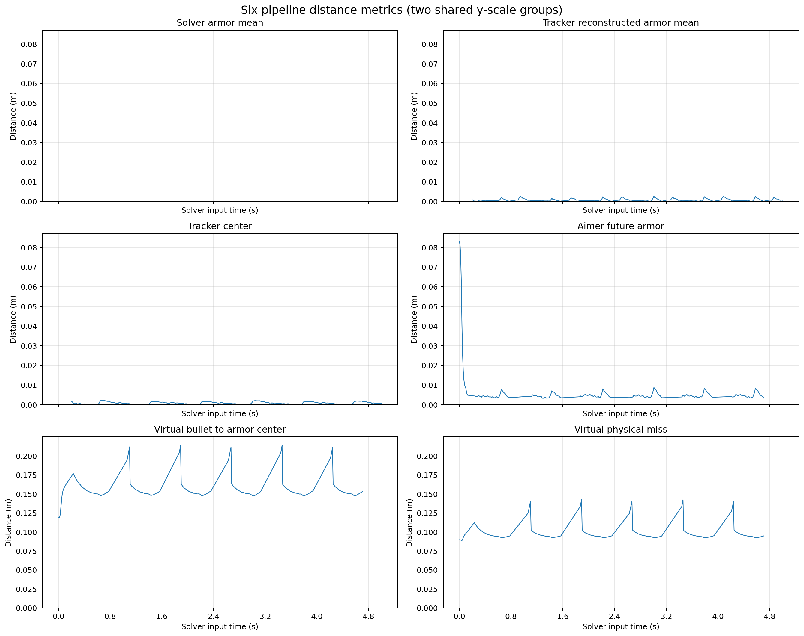

# AutoAim-Offline-Evaluation
# EGA 自瞄离线测评系统

An offline evaluation framework for vision-based robotic auto-aim systems.
This project aims to build a data-driven analysis pipeline for identifying error sources in auto-aim systems, including perception, tracking, prediction and system latency.

这是一个“Python 测评层 + C++ 被测算法”的离线 Pipeline。Python 负责生成/读取数据、接口校验、批量编排、误差计算、命中判定和报告；C++ runner 调用现有 `Solver → Tracker → Aimer → Shooter`。

当前第一版支持静止、匀速和小陀螺三个合成场景。默认使用确定性的 `mock` backend，因此在没有 OpenCV、Eigen、OpenVINO、CMake 的电脑上也能验证整个测评系统。`mock` 现在也只读取二维观测，用粗糙针孔模型产生占位输出；它不读取真值，其指标不代表真实算法能力。



## 项目背景 Why an offline test

Developing robotic auto-aim systems is often an iterative process involving perception, tracking, prediction and ballistic compensation. However, without a reproducible offline evaluation pipeline, algorithm development largely depends on repeated on-robot testing and empirical parameter tuning, making it difficult to locate the true source of errors or objectively compare different algorithmic improvements.

This project was initiated to build a data-driven evaluation framework that enables reproducible experiments, quantitative error analysis and systematic benchmarking. The goal is not only to evaluate algorithm performance, but also to identify where errors are introduced throughout the auto-aim pipeline, providing a reliable foundation for future optimization and research.

机器人自瞄系统涉及感知、跟踪、预测、弹道补偿等多个模块。缺乏可复现的离线评测流程时，算法开发通常依赖大量实机测试和经验调参，难以定位误差来源，也难以客观比较不同算法方案。

本项目旨在构建一套数据驱动的离线评测框架，实现可复现实验、定量误差分析和系统化 Benchmark。其目标不仅是评价算法性能，更重要的是分析误差在整个自瞄链路中的传播过程，为后续算法优化和研究提供可靠依据。

## 快速运行

在 `D:\lab\EGA` 下执行：

```powershell
python offline_test\run_pipeline.py --case spinning_target
python offline_test\run_pipeline.py --case static_target
python offline_test\run_pipeline.py --case linear_target
```

核心 Python Pipeline 无第三方依赖。配置文件使用 JSON 兼容的 YAML 1.2；安装 PyYAML 后也可使用普通 YAML 写法。

只生成并校验数据集：

```powershell
python offline_test\run_pipeline.py --case spinning_target --dataset-only
```

运行单元测试：

```powershell
python -m unittest discover offline_test\tests -v
```

比较所有历史运行：

```powershell
python offline_test\visual\compare_runs.py
```

## 目录

```text
offline_test/
├── apps/                   # C++离线runner
├── config/                 # 总配置和场景配置
├── data/common/            # 公共几何/弹道参数
├── data/cases/             # 自动生成或真实数据集
├── docs/data_interface.md  # 稳定数据协议
├── output/run_*/           # 每次独立运行的结果
├── py/offline_eval/        # Python生成、评价、命中和报告
├── tests/                  # Python单元测试
├── visual_analyse/         # 误差分析与可视化
├── CMakeLists.txt
└── run_pipeline.py
```

## 切换真实 C++ 算法

请在项目原本支持的 Ubuntu 22.04/OpenCV/Eigen/fmt/spdlog/yaml-cpp 环境构建：

```bash
cmake -S offline_test -B offline_test/build
cmake --build offline_test/build -j
python3 offline_test/run_pipeline.py --backend cpp --case spinning_target
```

C++ runner 只读取 `metadata.yaml`、`frames.jsonl` 和 `observations.jsonl`，不会打开 `ground_truth/`。Pipeline 在启动任一算法 backend 前还会创建只包含这三个文件的 `algorithm_input/` 目录，减少未来代码误读真值的风险；生成数据和真实数据都原样使用 `observations.jsonl` 中的四角点。该目录是应用层隔离，不等同于操作系统沙箱，因此自动测试还会扫描 runner 源码以防泄漏路径回归。

Python 生成器的投影模型必须与被测 Solver 的坐标系、内外参和畸变模型保持一致。修复隔离后误差变大时，应修正生成器投影模型，不能让 C++ 根据真值重新生成观测。

当前离线相机参数来自被测的 `2026_EGAIM/configs/demo.yaml`。生成器已经独立实现与 `Solver::reproject_armor()` 对应的相机外参变换、OpenCV五参数畸变和装甲板固定 pitch；测试会检查离线参数是否与 `demo.yaml` 漂移。

当前普通四装甲板场景按 Tracker默认模型使用 `radius=0.2 m`、`radius_delta=0`、`height_delta=0`。枪口位置按现有 Aimer/Trajectory 的隐式约定设为云台原点 `[0,0,0]`；这表示与软件模型一致，不代表已经测量了实体枪口偏移。

终端中的射击摘要采用 `shoot-enabled/evaluable/hits/hit rate`。其中第一项是 Shooter 允许开火的周期数，不等同于实体弹丸数量；真实射频限制和发弹反馈尚未接入。

默认 C++ 可执行文件位置为 `offline_test/build/auto_aim_offline`。Windows 会自动查找 `.exe` 需要时可在 `config/offline_test.yaml` 中修改 `runner.cpp_executable`。

## 一次运行的输出

```text
output/run_xxx_case/
├── manifest.json
├── run_config.yaml
├── algorithm_output.jsonl
├── solver_output.jsonl
├── shots.jsonl
├── frame_errors.csv
├── solver_errors.csv
├── summary.json
└── position_error.svg
```

`run_config.yaml` 保存命令行覆盖后的最终生效配置，不是源配置的简单副本。`manifest.json` 同时记录源配置和生效配置各自的路径及 SHA-256，并记录本次 `--backend`、`--case` 覆盖值，便于实验复现与审计。

评价时会排除配置中的 warmup 帧。Aimer 结果与 `impact_timestamp_ns` 时刻的装甲板真值比较，而不是与当前帧比较。角度误差统一进行 `-π/π` 环绕处理。

位置坐标采用 z 向上；控制指令保留现有 Aimer 约定，即抬头时 `command.pitch` 为负。Evaluator 已在理想角计算中做相同转换。

Pitch采用两层评价：`line_of_sight_pitch_difference` 只是相对几何视线的诊断量，不再叫误差；核心参考量是独立 RK4 弹道模型产生的 `ballistic_pitch_error`。最终命中率和 `physical_miss_distance` 直接按 command、弹速、枪口位置、重力、等效二次阻力和运动装甲板求交计算，不使用 Aimer 的预测点直接判中。

## 接入真实数据

1. 按 [数据接口规范](docs/data_interface.md) 准备目录。
2. 将 `data.mode` 改为 `dataset`，设置 `data.dataset_path`。
3. 保持 Ground Truth 只读。
4. 使用 `--backend cpp` 运行。

真实落点接入后，用 `ground_truth/shots.jsonl` 替换理想命中模型；Evaluator、逐节点误差和报告格式不需要重写。
